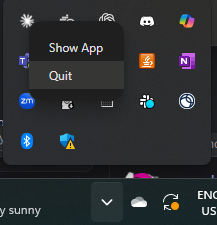

# Robot Control MCP


Control robots and design experiment through Claude Desktop using Model Context Protocol (MCP) and [IvoryOS](https://github.com/AccelerationConsortium/ivoryOS).

## Quick Start

### 1. Install IvoryOS
In the existing script environment, install ivoryos
```bash
pip install ivoryos
```


### 2. Start IvoryOS
**Option A - Function blocks:**
```python
import ivoryos

@ivoryos.block
def move_robot(x: float, y: float, z: float):
    """Move robot to specified coordinates"""
    # Your robot control logic here
    return True

ivoryos.run(__name__)
```

**Option B - Class instance:**
```python
import ivoryos

class RobotController:
    def move(self, x: float, y: float, z: float):
        """Move robot to specified coordinates"""
        # Your robot control logic here
        return True

robot = RobotController()

ivoryos.run(__name__)
```

### 3. Install uv and Claude Desktop
Install uv on Windows: 
```bash
powershell -ExecutionPolicy ByPass -c "irm https://astral.sh/uv/install.ps1 | iex"
```
Install uv on Mac/Linux:
```bash
curl -LsSf https://astral.sh/uv/install.sh | sh
```

### 4. Configure Claude Desktop

Add to your Claude Desktop config file:
- **macOS**: `~/Library/Application Support/Claude/claude_desktop_config.json`  
- **Windows**: `%APPDATA%\Claude\claude_desktop_config.json`

```json
{
  "mcpServers": {
    "IvoryOS MCP": {
      "command": "uvx",
      "args": [
        "ivoryos-mcp"
      ],
      "env": {
        "IVORYOS_URL": "http://127.0.0.1:8000/ivoryos",
        "IVORYOS_USERNAME": "your_username",
        "IVORYOS_PASSWORD": "your_password"
      }
    }
  }
}
```

### 5. Restart Claude Desktop
Quit the Claude Desktop on Windows (screenshot of quiting from the taskbar)



That's it! You can now control your robots through Claude.

### Developer Guide
The developer-friendly version (wip)


## Usage Examples

Ask Claude:
- "Tell me more about the platform"
- "Show robot status"
- "Execute calibration workflow" 
- "Move robot to position x=10, y=5"

## Troubleshooting

- **Connection failed?** Check if IvoryOS is running at the URL
- **Auth errors?** Verify username/password in config, check if you can login through the web app with the combination.
- **MCP not loading?** Restart Claude Desktop after config changes


## Resources
- **IvoryOS**: [repo](https://github.com/AccelerationConsortium/ivoryOS) | [docs](https://ivoryos.readthedocs.io/en/latest/)
- **IvoryOS Client**: [repo](https://github.com/ivoryzh/ivoryOS-client)
- **IvoryOS MCP**: [repo](https://github.com/AccelerationConsortium/ivoryOS-mcp) 
- **FastMCP**: [repo](https://github.com/jlowin/fastmcp) | [docs](https://gofastmcp.com/)
- **MCP Python SDK**: [repo](https://github.com/modelcontextprotocol/python-sdk) | [docs](https://modelcontextprotocol.io/docs/tools/python-sdk)

## Contributing

**Hackathon participants welcome!** Any contribution helps:

- 🤖 **Try with your platform** - Test with your robot/hardware setup
- 📝 **Share examples** - Add your robot control scripts  
- 🐛 **Report issues** - What broke? What's missing?
- 💡 **Suggest features** - What would make this more useful?
- 📚 **Improve docs** - Help others get started faster

No contribution too small - even trying it out and giving feedback is valuable!

---

🏆 **Hackathon Project** 
