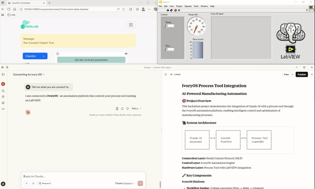

# Natural Language Control of LabVIEW *via* IvoryOS

This project demonstrates the integration of LabView automated tools into the self-driving lab software [IvoryOS](https://github.com/AccelerationConsortium/ivoryOS-MCP). The ability to control IvoryOS through Claude with an MCP interface allows to control the LabView software through natural language and easily integrate intelligent experimental design.

## 🚀 Quick Start

After running the 'main.py' file, the TCP server used to control the LabVIEW software can be started by clicking Devices → Chamber → Start Server. Then, the LabVIEW software needs to be started and the connection can be ensured by clicking *Is Connected* in the prior Ivory OS menu.

Afterwards, the LabVIEW software can be controlled either directly from the web interface or alternatively through natural language using the Claude interface:

## 🏗️ Architecture

**Claude AI** ◄──(*MCP*)──► **IvoryOS Platform** ◄──(*TCP*)──► **LabVIEW Control**

  
- **Claude AI**: Natural language processing and intelligent control

- *MCP*: Middleware Control Protocol for LLM-to-Ivory communication

- **IvoryOS**: Automation platform with workflow management

- *TCP*: Communication protocol layer connecting IvoryOS to LabVIEW

- **LabVIEW Control**: Interface to the PVD system hardware

## 👥 Team
Developed during the [LLM Hackathon for Applications in Materials Science & Chemistry](https://llmhackathon.github.io/) as part of [Ivory Zhang’s team](https://github.com/ivoryzh/MCP4SDL) in the Hein Lab at The University of British Columbia, this repository builds on the MCP server and provides an extended implementation.

## 📜 License

This project is licensed under the [MIT License](LICENSE).  
Note: LabVIEW itself and any NI toolkits remain subject to their own licensing terms.